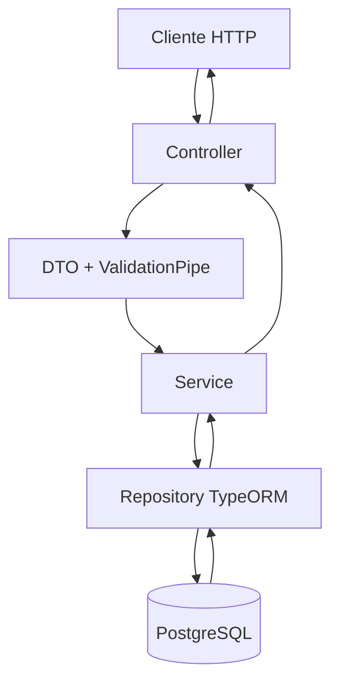

# 💼 MeuCRM

---

# 📝 Sobre o Projeto

O **MeuCRM** é uma aplicação web full stack para cadastro e gerenciamento de clientes, desenvolvida como parte de um case técnico para a posição de **Desenvolvedor Full Stack Júnior**.

O sistema tem como objetivo permitir que um usuário autenticado gerencie sua base de clientes por meio de uma interface web, realizando operações de cadastro, listagem, busca, consulta, atualização e exclusão.

O backend está sendo desenvolvido como uma **API REST** com **NestJS**, **TypeScript**, **TypeORM** e **PostgreSQL**. A infraestrutura utiliza **Docker Compose** para executar PostgreSQL e Redis. O frontend será desenvolvido com **Next.js**, **React** e **TypeScript**.

---

# 🎯 Objetivo

Aplicar, na prática, conceitos de desenvolvimento full stack e construção de aplicações web, incluindo:

- API REST;
- arquitetura modular com NestJS;
- validação de dados com DTOs;
- persistência com PostgreSQL e TypeORM;
- controle de alterações do banco com migrations;
- autenticação e autorização com JWT;
- processamento assíncrono com BullMQ e Redis;
- desenvolvimento de interfaces com Next.js e React;
- conteinerização com Docker;
- versionamento com Git e GitHub;
- documentação técnica;
- integração entre frontend e backend.

---

# Status do projeto

🚧 Projeto em desenvolvimento.

A infraestrutura e o CRUD de clientes no backend estão concluídos. As próximas etapas são a autenticação com JWT, a fila de boas-vindas com BullMQ e Redis e o desenvolvimento do frontend.

---

# Progresso do desenvolvimento

### Planejamento e infraestrutura

- [x] Análise dos requisitos do case
- [x] Planejamento inicial
- [x] Definição da estrutura do projeto
- [x] Configuração do repositório e fluxo de branches
- [x] Inicialização do backend com NestJS e TypeScript
- [x] Configuração do Docker Compose
- [x] Configuração do PostgreSQL em container
- [x] Configuração do Redis em container
- [x] Configuração das variáveis de ambiente
- [x] Integração entre NestJS, TypeORM e PostgreSQL

### Banco de dados

- [x] Modelagem da entidade Cliente
- [x] Configuração do DataSource do TypeORM
- [x] Configuração dos scripts de migration
- [x] Migration inicial da tabela `clientes`
- [x] Execução e validação da migration no PostgreSQL
- [ ] Seed do usuário administrador — 🚧 **Em construção**

### Backend — clientes

- [x] Entity de Cliente
- [x] DTO de criação
- [x] DTO de atualização
- [x] Validação automática com `ValidationPipe`
- [x] Cadastro de clientes
- [x] Listagem de clientes
- [x] Busca de clientes por nome
- [x] Consulta de cliente por UUID
- [x] Atualização de clientes com `PUT`
- [x] Exclusão de clientes
- [x] Validação de email único
- [x] Tratamento de cliente não encontrado
- [x] Validação dos endpoints por requisições HTTP

### Autenticação e segurança

- [x] Módulo de autenticação
- [x] DTO de login 
- [x] Login com email e senha 
- [x] Geração de token JWT 
- [x] Estratégia e guard de autenticação 
- [x] Proteção das rotas de clientes 

### Fila e processamento assíncrono

- [x] Redis disponível no Docker Compose
- [x] Configuração do BullMQ 
- [x] Fila `welcome-email` 
- [x] Adição de job após o cadastro do cliente 
- [x] Processor de boas-vindas 
- [x] Log de processamento no terminal 

### Frontend

- [ ] Inicialização do projeto Next.js — 🚧 **Em construção**
- [ ] Tela de login — 🚧 **Em construção**
- [ ] Proteção e redirecionamento de rotas — 🚧 **Em construção**
- [ ] Tabela de clientes — 🚧 **Em construção**
- [ ] Campo de busca por nome — 🚧 **Em construção**
- [ ] Formulário de cadastro — 🚧 **Em construção**
- [ ] Formulário de edição — 🚧 **Em construção**
- [ ] Confirmação de exclusão — 🚧 **Em construção**
- [ ] Integração com a API — 🚧 **Em construção**

### Entrega

- [x] Arquivo `.env.example` do backend
- [ ] README final revisado — 🚧 **Em construção**
- [ ] Credenciais do administrador documentadas — 🚧 **Em construção**
- [ ] Instruções do frontend — 🚧 **Em construção**
- [ ] Revisão final e preparação da branch `main` — 🚧 **Em construção**

---

# 🛠 Tecnologias

## Backend

- Node.js
- TypeScript
- NestJS
- TypeORM
- PostgreSQL
- `class-validator`
- `class-transformer`
- JWT — 🚧 **Em construção**
- BullMQ — 🚧 **Em construção**
- Redis

## Frontend

> 🚧 **Em construção**

- Next.js
- React
- TypeScript
- CSS

## Infraestrutura e ferramentas

- Docker
- Docker Compose
- Git
- GitHub
- Thunder Client
- pgAdmin

---

# 📋 Pré-requisitos

Antes de executar o projeto, certifique-se de possuir instalado:

- Node.js;
- npm;
- Git;
- Docker;
- Docker Compose;
- Visual Studio Code ou outra IDE compatível.

O pgAdmin e o Thunder Client são opcionais, mas podem ser utilizados para visualizar o banco de dados e testar os endpoints da API.

---

# 🚀 Instalação e Execução

## 1. Clone o repositório

> 🚧 O endereço definitivo do repositório será inserido antes da entrega.

```bash
git clone URL_DO_REPOSITORIO
```

Acesse a pasta do projeto:

```bash
cd meucrm
```

---

## 2. Inicie a infraestrutura

Na raiz do projeto, execute:

```bash
docker compose up -d
```

Esse comando inicia os containers do:

- PostgreSQL;
- Redis.

Para verificar o estado dos containers:

```bash
docker compose ps
```

Para encerrar os containers:

```bash
docker compose down
```

> Os dados do PostgreSQL são mantidos em volume Docker, conforme a configuração do `docker-compose.yml`.

---

## 3. Instale as dependências do backend

Acesse a pasta do backend:

```bash
cd backend
```

Instale as dependências:

```bash
npm install
```

---

## 4. Configure as variáveis de ambiente

Crie o arquivo `.env` a partir do exemplo:

```bash
cp .env.example .env
```

O backend utiliza variáveis de ambiente para definir a porta da aplicação e os dados de conexão com o PostgreSQL.

Exemplo:

```env
PORT=3000
PG_HOST=localhost
PG_PORT=5433
PG_DATABASE=meucrm
PG_USER=postgres
PG_PASSWORD=postgres
```

> Nunca envie o arquivo `.env` para o repositório. Utilize o `.env.example` como modelo, sem credenciais sensíveis.

As variáveis de autenticação JWT e fila serão documentadas quando essas funcionalidades forem implementadas.

---

## 5. Execute as migrations

Com PostgreSQL ativo, execute:

```bash
npm run typeorm -- migration:run
```

Esse comando aplica as migrations pendentes e cria a estrutura necessária no banco de dados.

Para consultar as migrations:

```bash
npm run typeorm -- migration:show
```

---

## 6. Inicie o backend

### Ambiente de desenvolvimento

```bash
npm run start:dev
```

A API estará disponível em:

```text
http://localhost:3000
```

### Aplicação compilada

Primeiro, compile o projeto:

```bash
npm run build
```

Depois, execute a versão compilada:

```bash
npm run start:prod
```

---

## 7. Inicie o frontend

> 🚧 **Em construção.** Os comandos de instalação e execução serão adicionados após a criação do projeto Next.js.

---

# 📜 Scripts do Backend

| Comando | Descrição |
|---|---|
| `npm run start` | Inicia o backend |
| `npm run start:dev` | Inicia o backend em modo de desenvolvimento e observa alterações |
| `npm run build` | Compila o projeto NestJS |
| `npm run start:prod` | Executa a versão compilada em `dist` |
| `npm run format` | Formata os arquivos TypeScript com Prettier |
| `npm run lint` | Executa o ESLint e aplica correções disponíveis |
| `npm run test` | Executa os testes unitários |
| `npm run test:e2e` | Executa os testes de ponta a ponta |
| `npm run test:cov` | Executa os testes e gera o relatório de cobertura |
| `npm run typeorm -- migration:show` | Lista as migrations e seus estados |
| `npm run typeorm -- migration:run` | Executa as migrations pendentes |
| `npm run typeorm -- migration:revert` | Reverte a última migration executada |

> Os scripts de teste fazem parte da estrutura inicial do NestJS. A implementação de testes automatizados é considerada uma melhoria futura e um bônus do case.

---

# 📂 Estrutura do Projeto

```text
meucrm/
│
├── backend/
│   ├── src/
│   │   ├── clientes/
│   │   │   ├── dto/
│   │   │   │   ├── create-cliente.dto.ts
│   │   │   │   └── update-cliente.dto.ts
│   │   │   ├── cliente.entity.ts
│   │   │   ├── clientes.controller.ts
│   │   │   ├── clientes.module.ts
│   │   │   └── clientes.service.ts
│   │   │
│   │   ├── database/
│   │   │   ├── migrations/
│   │   │   └── data-source.ts
│   │   │
│   │   ├── app.controller.ts
│   │   ├── app.module.ts
│   │   ├── app.service.ts
│   │   └── main.ts
│   │
│   ├── .env.example
│   ├── package.json
│   ├── package-lock.json
│   ├── nest-cli.json
│   └── tsconfig.json
│
├── frontend/                         # 🚧 Em construção
├── .gitignore
├── docker-compose.yml
└── README.md
```

As pastas de autenticação, filas e frontend serão adicionadas à árvore conforme forem implementadas.

---

# 🔄 Arquitetura e Fluxo da Aplicação

O backend utiliza a organização modular do NestJS. Cada módulo reúne controller, service, DTOs e entity relacionados à mesma funcionalidade.



### Exemplo: cadastro de cliente

```text
POST /clientes
    → ClientesController
        → CreateClienteDto + ValidationPipe
            → ClientesService
                → Repository<Cliente>
                    → PostgreSQL
```

Após a implementação da fila, o cadastro também adicionará um job assíncrono à fila `welcome-email`.

---

# 📚 Funcionalidades do Sistema

## Autenticação

> 🚧 **Em construção**

- Login com email e senha;
- geração de token JWT;
- proteção dos endpoints;
- redirecionamento para login quando o usuário não estiver autenticado.

## Clientes

- Cadastrar cliente;
- listar todos os clientes;
- buscar clientes pelo nome;
- consultar cliente por UUID;
- atualizar cliente;
- excluir cliente;
- validar campos obrigatórios e opcionais;
- impedir o cadastro de emails duplicados.

## Fila de boas-vindas

> 🚧 **Em construção**

Após o cadastro de um novo cliente, a aplicação adicionará um job à fila `welcome-email`. Um processor consumirá o job e registrará no terminal uma mensagem semelhante a:

```text
[WelcomeEmailProcessor] Enviando boas-vindas para joao@empresa.com
```

## Interface web

> 🚧 **Em construção**

O frontend deverá disponibilizar:

- tela de login;
- tabela com nome, email, telefone, empresa e ações;
- campo de busca por nome;
- formulário de cadastro e edição;
- confirmação antes da exclusão;
- rotas protegidas.

---

# 🌐 Endpoints da API

## Clientes

| Método | Endpoint | Descrição | Status |
|---|---|---|---|
| `POST` | `/clientes` | Cadastra um cliente | ✅ Implementado |
| `GET` | `/clientes` | Lista todos os clientes | ✅ Implementado |
| `GET` | `/clientes?busca=nome` | Busca clientes por nome | ✅ Implementado |
| `GET` | `/clientes/:id` | Consulta um cliente pelo UUID | ✅ Implementado |
| `PUT` | `/clientes/:id` | Atualiza um cliente | ✅ Implementado |
| `DELETE` | `/clientes/:id` | Exclui um cliente | ✅ Implementado |

## Autenticação

> 🚧 **Em construção.** O endpoint de login será documentado após sua implementação.

---

# ✅ Validações e Regras

- `nome`, `email` e `telefone` são obrigatórios;
- `nome` possui limite de 100 caracteres;
- `email` deve possuir formato válido e limite de 255 caracteres;
- o email deve ser único;
- `telefone` possui limite de 20 caracteres e deve seguir o formato definido pela API;
- `empresa` é opcional e possui limite de 100 caracteres;
- `observacoes` é opcional;
- o identificador do cliente é um UUID gerado automaticamente;
- `criadoEm` é preenchido automaticamente pelo banco;
- campos não declarados nos DTOs são rejeitados pelo `ValidationPipe`;
- buscas por nome não diferenciam letras maiúsculas e minúsculas.

---

# 🗃 Banco de Dados

O MeuCRM utiliza PostgreSQL como Sistema Gerenciador de Banco de Dados. O acesso aos dados é realizado com TypeORM, por meio de entities e repositories.

## Migrations

O projeto utiliza migrations do TypeORM para controlar a evolução da estrutura do banco. A sincronização automática está desativada:

```ts
synchronize: false
```

As migrations ficam em:

```text
backend/src/database/migrations/
```

A tabela `migrations`, mantida pelo TypeORM, registra quais alterações já foram executadas.

## Tabela `clientes`

| Coluna | Tipo | Regra |
|---|---|---|
| `id` | UUID | Chave primária e geração automática |
| `nome` | `varchar(100)` | Obrigatório |
| `email` | `varchar(255)` | Obrigatório e único |
| `telefone` | `varchar(20)` | Obrigatório |
| `empresa` | `varchar(100)` | Opcional |
| `observacoes` | `text` | Opcional |
| `criado_em` | `timestamp` | Preenchimento automático com `now()` |

## Seed

> 🚧 **Em construção.** Será criado um usuário administrador fixo para permitir o login exigido no case.

---

# 🔐 Autenticação

> 🚧 **Em construção**

A aplicação utilizará autenticação com JWT. O fluxo previsto é:

```text
Email e senha
    → endpoint de login
        → validação das credenciais
            → geração do token JWT
                → acesso às rotas protegidas
```

As credenciais do usuário administrador serão incluídas nesta seção após a implementação do seed e da autenticação.

---

# 📬 BullMQ e Redis

> 🚧 **Em construção**

O Redis já está disponível na infraestrutura Docker. A próxima etapa será configurar o BullMQ para:

1. criar a fila `welcome-email`;
2. adicionar um job após o cadastro do cliente;
3. processar o job assincronamente;
4. registrar o envio simulado no terminal.

---

# 🌿 Versionamento

O projeto utiliza branches para separar o desenvolvimento das funcionalidades e manter a branch principal estável.

## Branches

```text
main
dev
feat/*
fix/*
```

- **main:** versão estável e preparada para entrega;
- **dev:** integração das funcionalidades durante o desenvolvimento;
- **feat/:** desenvolvimento de novas funcionalidades;
- **fix/:** correções específicas.

Exemplos:

```text
chore/configura-infraestrutura
chore/configura-typeorm
feat/crud-clientes
fix/atualiza-clientes
feat/autenticacao
feat/fila-boas-vindas
```

## Fluxo resumido

```text
dev
    → branch temporária
        → implementação
            → build e testes
                → commit e push
                    → integração em dev
                        → revisão final
                            → main
```

---

# 🤖 Uso de IA

Ferramentas de inteligência artificial foram utilizadas como apoio durante o desenvolvimento para:

- compreender conceitos do NestJS, Docker, TypeORM e migrations;
- esclarecer dúvidas sobre arquitetura e organização do projeto;
- revisar trechos de código escritos pela autora;
- apoiar o planejamento das etapas de desenvolvimento;
- auxiliar na elaboração e revisão da documentação;
- identificar possíveis erros e alternativas de implementação.

As decisões de implementação, adaptações aos requisitos do case, escrita do código e execução dos comandos foram realizados e revisados pela autora.

---

## 👩‍💻 Autora

Desenvolvido por [Bruna Fraga](https://github.com/brunafraga-0).

---

# 📄 Licença

Projeto desenvolvido exclusivamente para fins de avaliação técnica e aprendizado.

---
